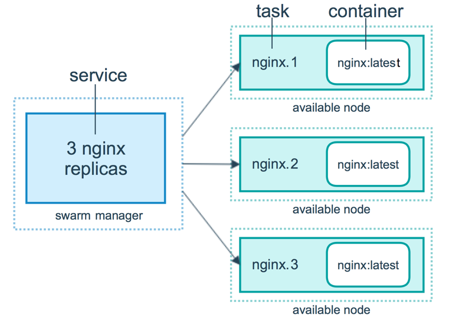

# Docker Swarm
## 简介
Docker Swarm是Docker的集群管理工具。它将Docker主机池转变为单个虚拟 Docker 主机。 
Docker Swarm提供了标准的 Docker API，所有任何已经与 Docker 守护程序通信的工具都
可以使用 Swarm 轻松地扩展到多个主机。
支持的工具包括但不限于以下各项：
    Dokku
    Docker Compose
    Docker Machine
    Jenkins
## 原理
Swarm集群由管理节点（manager）和工作节点（work node）构成。  
管理节点（manager）:负责整个集群的管理工作，包括集群配置、服务管理等所有跟集群有关的工作。  
工作节点（work node）:  即图中的 available node，主要负责运行相应的服务来执行任务（task）。



## 集群环境搭建
1. 创建Docker机器节点
   ```$xslt2
   docker-machine create -generic --generic-ip-address 192.168.199.140 swarm-manager
   ```
2. 初始化swarm集群，并指定管理节点ip，就是集群的管理节点。
   ```$xslt2
   docker-machine ssh swarm-manager
   # 这里的 IP 为创建机器时分配的 ip。
   # 此命令执行后，会打印出增加工作节点的命令
   docker swarm init --advertise-addr 192.168.199.140 
   # 打印出的增加工作节点的命令
   docker swarm join --token SWMTKN-1-4oogo9qziq768dma0uh3j0z0m5twlm10iynvz7ixza96k6jh9p-ajkb6w7qd06y1e33yrgko64sk 192.168.199.140:2377
   ``` 
3. 创建Swarm集群工作节点
   ```$xslt2
   # 创建工作节点集群swarm-worker1和swarm-worker2
   docker-machine create -generic --generic-ip-address 192.168.199.141 swarm-worker1
   docker-machine create -generic --generic-ip-address 192.168.199.142 swarm-worker2 
   # 进入swarm-worker1机器
   docker-machine ssh swarm-worker1
   # 指定为工作节点
   docker swarm join --token SWMTKN-1-4oogo9qziq768dma0uh3j0z0m5twlm10iynvz7ixza96k6jh9p-ajkb6w7qd06y1e33yrgko64sk 192.168.199.140:2377
   ``` 
4. 查看集群信息
   ```$xslt2
   # 进入管理节点，然后执行一下命令
   docker info
   ```
5. 部署服务到集群中去  
   注意：跟集群管理有关的任何操作，都是在管理节点上操作的。
   ```$xslt2
    docker service create --replicas 1 --name helloworld alpine ping docker.com
   ``` 
6. 查看服务部署情况
   ```$xslt2
   docker service ps helloworld
   ```
7. 查看服务部署的详细信息
   ```$xslt2
   docker service inspect --pretty helloworld
   ```  
8. 扩展集群服务
   ```$xslt2
   # 扩展服务为两个节点
   docker service sclae helloworld=2
   ```   
9. 删除服务
   ```$xslt2
   docker service rm helloworld
   ```   
10. 滚动升级服务
   ```$xslt2
   # 创建一个3.06版本的redis
   docker service create --replicas 1 --name redis --update-delay 10s redis:3.0.6
   # 滚动升级redis
   docker service update --image redis:3.0.7 redis
   ```  
11. 停止某个节点接收新的任务
   ```$xslt2
   # 查看所有的节点
   docker node ls
   # 停止swarm-worker1节点
   # 不会影响到集群的服务，只是 swarm-worker1 节点不再接收新的任务，集群的负载能力有所下降
   docker node update --availability drain swarm-worker1
   # 激活节点
   docker node update --availability active swarm-worker1
   ```     


            