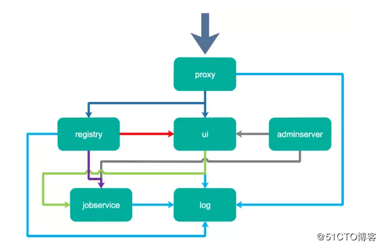

# 私有仓库Harbor笔记
## Harbor简介
1. 是什么？  
官方概念：Harbor是一个开放源代码容器映像镜像表，可通过基于角色的访问控制来保护镜像，扫描
镜像中的漏洞并将镜像签名为受信任。 作为CNCF孵化项目，Harbor提供合规性，性能和互操作性，
以帮助您跨Kubernetes和Docker等云原生计算平台持续，安全地管理镜像。  
简单来说，Harbor就是一个开源的镜像管理仓库，类似Github一样，可以让我们存放一些镜像文件。
详细内容，参看官方文档 
2. 为什么要用？  
之前的Springboot项目每次都需要在服务器创建镜像，当我有多台服务器需要用到这个镜像，我还得
重复在每台服务器上创建一次，那有没有一个中间存储服务帮我们管理这些镜像，让所有的服务器可以
共享这个镜像文件呢？Harbor的作用就是帮我们管理镜像，采用分布式架构，让我们可以在任意服务器
拉去我们构建好的镜像文件。然后又会有人问我们不是已经有docker hub或者 docker hub这些远程
仓库了吗？确实，但是当我们需要搭建一些私有镜像仓库，不想把公司项目对外公开的时候，Harbor就
很有用了，就像很多公司也会在自己公司搭建私有的nexus服务器来管理公司内部的应用package。
## Harbor组件

| 组件               | 功能                                      |
| ------------------ | ----------------------------------------- |
| harbor-adminserver | 配置管理中心                              |
| harbor-db          | Mysql数据库                               |
| harbor-jobservice  | 负责镜像复制                              |
| harbor-log         | 记录操作日志                              |
| harbor-ui          | Web管理页面和API                          |
| nginx              | 前端代理，负责前端页面和镜像上传/下载转发 |
| redis              | 会话                                      |
| registry           | 镜像存储                                  |



## Harbor搭建
1. 到github选择一个harbor release版本下载
    ```$xslt2
    https://github.com/goharbor/harbor/releases #国内访问下载过慢
    或者直接
    wget https://storage.googleapis.com/harbor-releases/release-1.10.0/harbor-offline-installer-v1.10.2.tgz # 这个相对来说比较快
    ```
    
2. 上传到linux服务器，然后解压
    ```$xslt2
    tar -zxvf harbor-v1.0.1.tar.gz
    ```
    
3. 修改harbor配置文件habor.yml
    ```$xslt2
    #设置域名
    hostname: 192.168.199.132
    
    #设置http参数
    # http related config
    http:
      # port for http, default is 80. If https enabled, this port will redirect to https port
      port: 8090
      
    #设置管理员密码
    harbor_admin_password: admin123
    
    #屏蔽https
    #https:
      # https port for harbor, default is 443
     # port: 443
    ```
注意：  
上面修改了hostname为我虚拟机的ip，端口把默认80端口替换成8090，并且修改了管理员密码为admin123。
需要注意，我这里屏蔽了https，如果大家需要开启https，需要配置证书和key到指定位置。
    
4. 开启Docker http访问权限 
    Docker默认是不支持http访问注册表，否则后面使用docker去访问harbor服务。否则，会报出错误。

  修改/etc/docker/daemon.json配置，加入一下配置：

  ```
  {
    "insecure-registries": ["192.168.199.132:8090"]
  }
  ```

   重启docker服务

  ```
  systemctl daemon-reload
  systemctl start docker
  ```

5. 启动Harbor应用

   假设没有Docker环境，harbor会报错。

   ```
   root@zmf harbor]# sh install.sh 
   [Step 0]: checking if docker is installed ...
   Note: docker version: 19.03.7
   [Step 1]: checking docker-compose is installed ...
   Note: docker-compose version: 1.25.0
   [Step 2]: loading Harbor images ...
   Cannot connect to the Docker daemon at unix:///var/run/docker.sock. Is the docker daemon running?
   ```

   需要先安装`Docker`和`docker-compose`组件，当启动Docker后，执行`install.sh`会自动完成安装
    ```
[root@zmf harbor]# sh install.sh 
   ...
   Creating network "harbor_harbor" with the default driver
   Creating harbor-log ... done
   Creating harbor-portal ... done
   Creating registry      ... done
   Creating redis         ... done
   Creating harbor-db     ... done
   Creating registryctl   ... done
   Creating harbor-core   ... done
   Creating nginx             ... done
   Creating harbor-jobservice ... done
   ? ----Harbor has been installed and started successfully.----
    ```

	这个时候已经显示安装成功。

6. 访问Harbor

   在浏览器输入上面我们配置的ip和端口`192.168.101.11:8090`，就会看到`harbor`登陆页面.

   - 账号 - admin
   - 密码 - admin123
## Harbor操作

1. 创建一个Harbor项目，设置访问级别、存储等属性

   

   

2. 使用Docker登录Harbor

   ```
   [root@zmf harbor]# docker login 192.168.199.132:8090
   Username: admin
   Password: 
   WARNING! Your password will be stored unencrypted in /root/.docker/config.json.
   Configure a credential helper to remove this warning. See
   https://docs.docker.com/engine/reference/commandline/login/#credentials-store
   
   Login Succeeded
   ```

   

3. 对Image打包

   ```
   docker tag hello-world:latest  hello-world:1.0
   ```

   

4. 发布镜像到Harbor

   使用Harbor的ip地址和前面创建好的项目名称进行发布

   ```
   [root@zmf harbor]# docker push 192.168.199.132:8090/hello-world/hello-world:1.0
   The push refers to repository [192.168.101.11:8090/hello-world/hello-world:1.0]
   21f243c9904f: Pushed 
   edd61588d126: Pushed 
   9b9b7f3d56a0: Pushed 
   f1b5933fe4b5: Pushed 
   latest: digest: sha256:86a6289143d0a8a4cc94880b79af36416d07688585f8bb1b09fd4d50cd166f46 size: 1159
   ```

   

5. 从Harbor拉取镜像

   ```
   [root@zmf harbor]# docker pull 192.168.199.132:8090/hello-world/hello-world:1.0
   latest: Pulling from credit-facility/credit-facility-image
   Digest: sha256:86a6289143d0a8a4cc94880b79af36416d07688585f8bb1b09fd4d50cd166f46
   Status: Downloaded newer image for 192.168.101.11:8090/credit-facility/credit-facility-image:latest
   192.168.101.11:8090/credit-facility/credit-facility-image:lates
   ```

   

## Harbor UI使用手册

