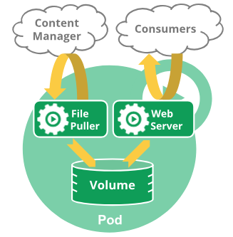

# Kubernetes Pod
## 了解Pod
Pod是Kubernetes创建和部署的最小/最简单的基本单位。一个Pod代表集群中
正在运行的进程。
一个Pod封装一个应用容器（也可以多个容器）、存储资源、一个独立的网格Ip
以及管理控制容器的运行方式策略。Pod代表部署的一个单位：Kubernetes中
单个应用实例，它可能由单个或多个容器共享组成的资源
注：Docker是Kubernetes Pod最常用的runtime,当然也可以使用其他runtime。
Kubernetes中的Pod使用主要分为两种方式：
* Pod中运行一个容器。“one-container-per-Pod”模式是Kubernetes最常见的
  用法; 在这种情况下，你可以将Pod视为单个封装的容器，但是Kubernetes是直接
  管理Pod而不是容器。
* Pods中运行多个需要一起工作的容器。Pod可以封装紧密耦合的应用，它们需要由多
  个容器组成，它们之间能够共享资源，这些容器可以形成一个单一的内部service
  单位。一个容器共享文件，另一个“sidecar”容器来更新这些文件。Pod将这些容器
  的存储资源作为一个实体来管理。  
每个Pod都是运行应用的单个实例，如果需要水平扩展应用（例如，运行多个实例），则
应该使用多个Pods，每个实例一个Pod。在Kubernetes中，这样通常称为Replication
。Replication的Pod通常由Controller创建和管理。
## Pod如何管理多个容器
Pod被设计成支持形成内聚服务单元的多个协作过程（作为容器）。Pod中的容器被自动
的安排到集群中的同一物理或虚拟机上，并可以一起进行调度。 容器可以共享资源和依
赖、彼此通信、协调何时以及何种方式终止它们。  
注意，在单个Pod中将多个并置和共同管理的容器分组是一个相对高级的使用方式。只在
容器紧密耦合的特定实例中使用此模式。例如，您可能有一个充当共享卷中文件的Web服
务器的容器，以及一个单独的sidecar容器，该容器从远端更新这些文件，如下图所示：  
  
有些Pod具有初始容器和应用容器，初始容器会在应用容器启动前运行完成。  
Pod为其组成容器提供了两种共享资源：网络和存储。  
### 网络
每个Pod分配一个唯一的IP地址。Pod中的每个容器共享网络命名空间，包括IP地址和网
络端口。Pod内的容器可以使用localhost互相通信。当Pod中的容器与Pod之外的实体
通信时，它们必须协调如何使用共享的网络资源（例如端口）。
### 存储
一个Pod可以指定一组共享存储卷。Pod中的所有容器都可以访问共享卷，允许这些容器
共享数据。卷还允许Pod中的持久数据保留下来，以防其中的容器需要重新启动。
## Pod的使用
我们很少在Kubernetes中直接创建Pod，这是因为Pod被设计为短暂的实体存在。而且
Pod本身并不能自愈。如果Pod被调度到失败的节点，或者如果调度操作本身失败，则删
除该Pod；同样，由于缺乏资源或进行节点维护，Pod在被驱逐后将不再生存。
所以Kubernetes使用了一个更高级的称为控制器的抽象，由它处理相对可丢弃的Pod实
例的管理工作。通过控制器实现Pod的伸缩和愈合。
## Pod的控制器
控制器可以为您创建和管理多个Pod，管理副本和上线，并在集群范围内提供自修复能力。
例如，如果一个节点失败，控制器可以在不同的节点上调度一样的替身来自动替换Pod。
包含一个或多个Pod的控制器一些示例包括：
* Deployment
* StatefulSet
* DaemonSet  
控制器通常使用您提供的Pod模板来创建它所负责的Pod。
## Pod模板
Pod模板是包含在其他对象中的Pod规范。配置文件如[template-pod.yaml](./template-pod.yaml)